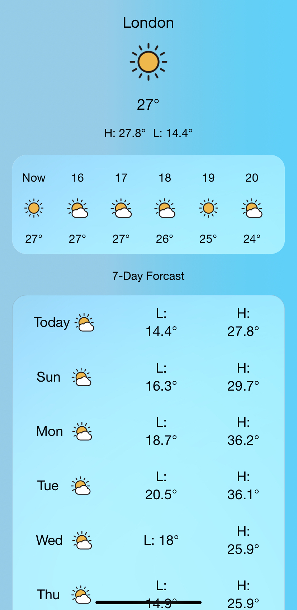
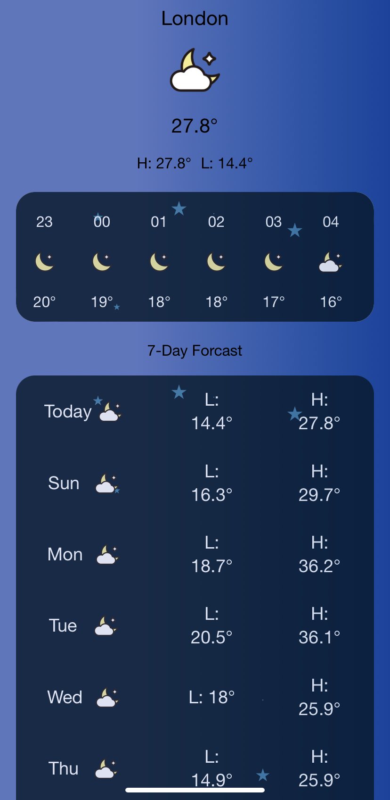

<h1 align="center">Weather App 👋</h1>
<p>
  <a href="https://github.com/mrchreesa/weather-app/tree/master" target="_blank">
    
  </a>
  <a href="https://twitter.com/mrchreesa" target="_blank">
    
  </a>
    <br/>
  <a href="https://linkedin.com/in/kristian-rahnev-90b35913a/" target="_blank">
  
  </a>
</p>
    The Weather App was build with React and used useReducer hook for state management.
    The user interface was created with Sass and Material UI. The app fetches data from Weather Forecast API and uses Moment.js to work with time and dates. Day and Night themes are toggled according to the sunset and sunrise times.
    <br/>
<div margin-top="40px">


</div>
<h1 align="center"> 🏠 (https://dancing-sopapillas-af9c8b.netlify.app/) </h1>
</br>
<p align="center">
 🔶🔶🔶 Technologies 🔶🔶🔶
 </p>
<p align="center">
- HTML5
- CSS3
- JavaScript (ES6)
- React
- Material UI
- SASS
- Moment.js
- Axios
</p>
</br>
<h1 align="center"> 🏠 (https://www.krisrahnev.com/) </h1>
</br>
## Usage

```
npm install

npm start
```

## Author

👤 **Kristian Rahnev**

- Twitter: [@mrchreesa](https://twitter.com/mrchreesa)
- Github: [@mrchreesa](https://github.com/mrchreesa)
- LinkedIn: [@kristian-rahnev-90b35913a/](https://linkedin.com/in/kristian-rahnev-90b35913a/)

## Show your support

Give a ⭐️ for this project!
